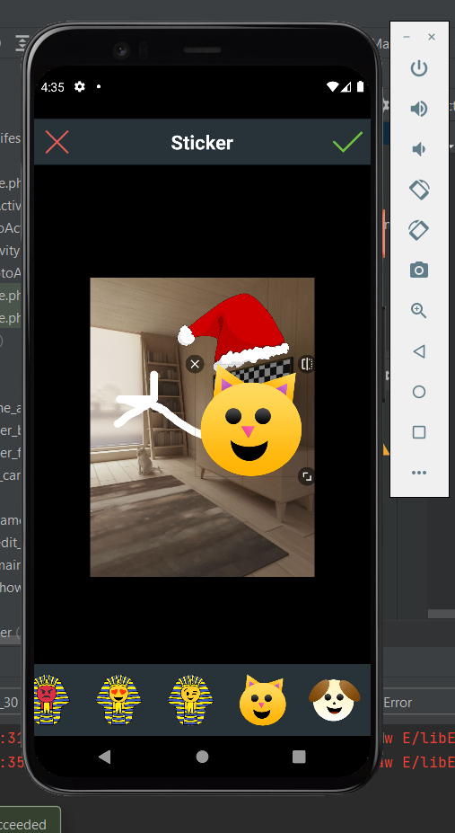
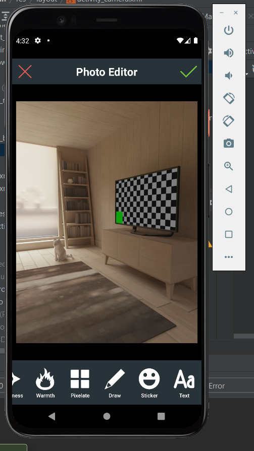
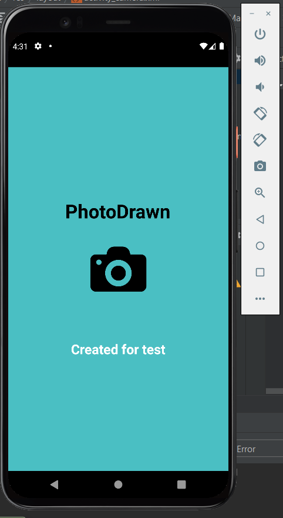
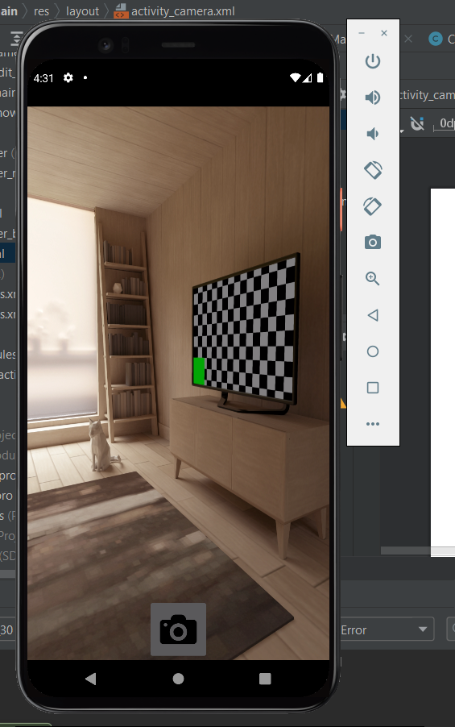
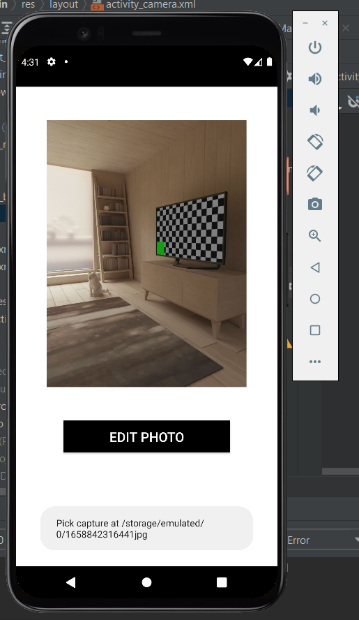

# PhotoDrawn-Android

## Android , Java , CameraX , SDK DS-Photo , Glide

PhotoDrawn-Android
- :white_check_mark: drawing in a picture by finger (using touchscreen);
- :white_check_mark: user should be able to choose a color of ink;
- :white_check_mark: there should be a possibility to add elements to the picture (so please also
add some elements to the library which could be used)

## Result ✅

## Editor ✅

#  ✅

# ✅

# ✅

